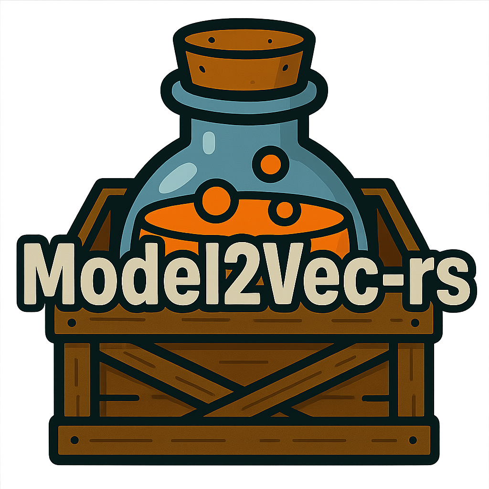

<div align="center">
    <picture>
      
    </picture>
  </a>
</div>


This crate provides a lightweight Rust implementation for loading and running inference on [Model2Vec](https://github.com/MinishLab/model2vec) static embedding models from either local folders or the Hugging Face Hub.

## Quick Start

Add the crate:

```bash
cargo add model2vec-rs
```

Make embeddings:

```rust
use anyhow::Result;
use model2vec_rs::model::StaticModel;

fn main() -> Result<()> {
    // Load a model from the Hugging Face Hub or a local path
    // args = (repo_or_path, token, normalize, subfolder)
    let model = StaticModel::from_pretrained("minishlab/potion-base-8M", None, None, None)?;

    // Prepare a list of sentences
    let sentences = vec![
        "Hello world".to_string(),
        "Rust is awesome".to_string(),
    ];

    // Create embeddings
    let embeddings = model.encode(&sentences);
    println!("Embeddings: {:?}", embeddings);

    Ok(())
}
```


Make embeddings with the CLI:

```rust
# Single sentence
cargo run -- encode "Hello world" minishlab/potion-base-8M

# Multiple lines from a file
echo -e "Hello world\nRust is awesome" > input.txt
cargo run -- encode input.txt minishlab/potion-base-8M --output embeds.json
```


Make embeddings with custom encode args:

```rust
let embeddings = model.encode_with_args(
    &sentences,     // input texts
    Some(512),  // max length
    1024,       // batch size
);
```

## License

MIT